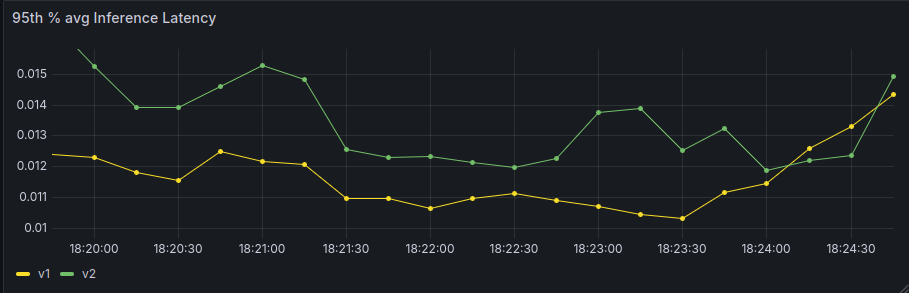
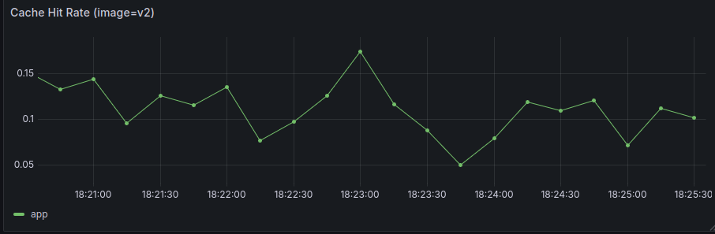
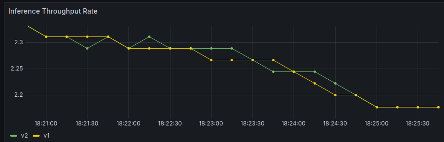
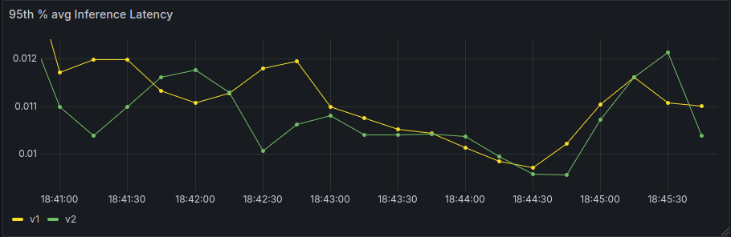
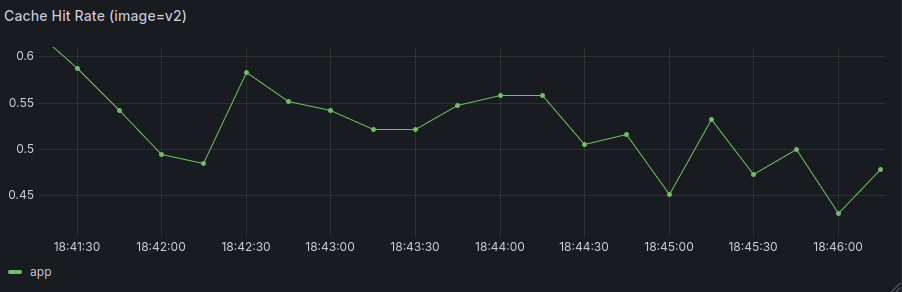
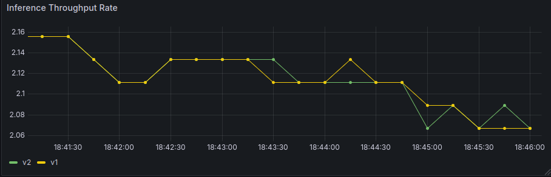
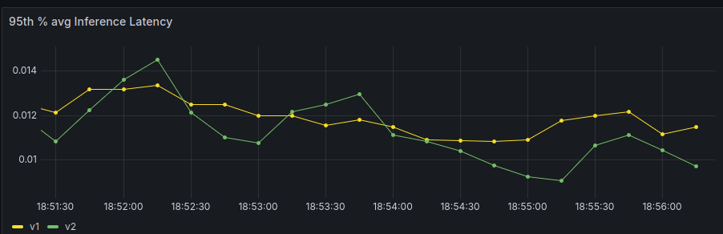
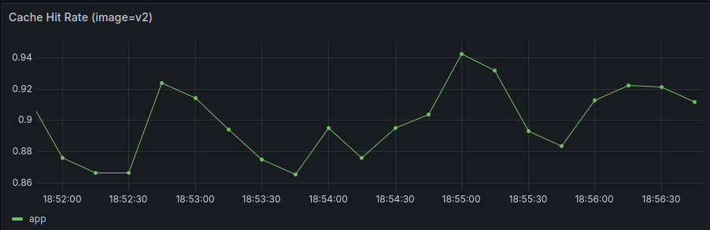
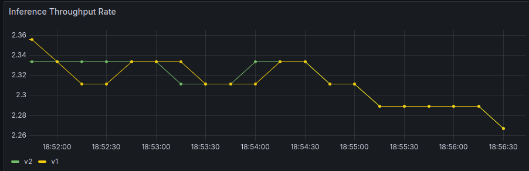

# Continuous Experimentation
This document details the method, assumptions and results of our experiment into the efficacy of model result caching on inference time.

## Background
The application frontend (refered to as *app*) exposes a webpage where a user can submit a string review. This review is submitted to our model-service which does a sentiment classification (positive or negative). This classification, the communication between the services and response all take time. 

*The time between the submission of input and receiving a classification is called the inference delay*

This delay is, presumably, largely affected by the time the ML model takes to classify the input. By saving earlier input-output pairs the chance exists that a identical input will be tried. This leads to the core idea of this experiment. *"Does caching inference results positively impact inference delay over extended periods of time"*. 

## Experiment Setup
To answer the research question two different deployed versions of the app need to be made. The app image containing the experimental version can be found [here](https://github.com/remla25-team6/app/pkgs/container/app/436652457?tag=0.1.0-experimental) (app:v0.1.0-experimental). 

To achieve the desired caching behaviour the ```ModelController.java``` class in the *app* was modified in the following way:

```java
public String postReview(@RequestParam("review") String review, Model model) throws InferenceFailedException {
    // Inference metric start timer:
    Timer.Sample sample = metrics.startInferenceTimer();
    // Process and persist inference
    SentimentModel hit;
    try {
        // Check if already present
        if ((hit = modelService.findByInput(review)) != null) {
            metrics.recordCacheHit();
        } else {
            hit = modelService.processSentiment(review);
        }
    } catch (Exception ex) {
        // We need to stop the timer and then rethrow because spring handles it in the end.
        metrics.recordInferenceFailure();
        metrics.stopInferenceTimer(sample);
        throw ex;
    }
    metrics.stopInferenceTimer(sample);
    // Retrieve all previous inferences.
    List<SentimentModel> responses = modelService.getAllPreviousResults();
    responses.remove(hit);
    responses.add(0, hit);
    metrics.updateStoredResponsesCount(responses.size());
    // MVC
    model.addAttribute("responses", responses);
    model.addAttribute("version", VersionUtil.getVersion());
    return "index";
}
```

In practice all other available images can be used as a baseline, given that caching is not implemented in any other version. For consistency, however, the baseline imaged used througout this experiment can be found [here](https://github.com/remla25-team6/app/pkgs/container/app/435035938?tag=0.1.1) (app:v0.1.1)

All other relevant images needed in deployment are consistent between the two app images used in the experiment. For transperancy they are mentioned here:
```yaml
# model-service images (consistent)
image: ghcr.io/remla25-team6/model-service:0.2.2-pre.20250609.165306
image2: ghcr.io/remla25-team6/model-service:0.2.2-pre.20250609.165306
# ML-model version (consistent)
mlModelVersion: "v0.1.0"
mlModelVersion2: "v0.1.0"
```

### Hypothesis
The experiment is designed to test the following hypothesis:
* $H_0$: Implementing result caching has no effect on the 95th-percentile inference delay.
* $H_A$: Implementing result caching leads to a significant reduction in the 95th-percentile inference delay.


### Metrics
To evaluate the above hypothesis, the following key metrics are collected via Prometheus and visualized in Grafana for both *v1* and *v2*.
* Inference Latency (p95): The 95th-percentile latency of requests. This is the primary metrics used to decide over our hypothesis.
* Cache Hit Rate: The percentage of requests served directly from the cache in the experimental version. This metric validates that the caching is working as expected.
* Throughput: The number of requests per time-unit. This metric is used to guarantee equal load on both app's and ensures a more fair comparison between the above metrics.

Additionally, the same experiment will be run for multiple different probabilities of duplicate inputs. Namely, the cases $Pr=0.1$, $Pr=0.5$ and $Pr=0.9$. These numbers concretely refer to the probability of any arbitrary synthesized request to be a value previously sent (cache-hit).

### Decision Process
The decision to accept or reject the hypothesis will be made based on data visualized on our Grafana dashboard. The dashboard provides a side-by-side comparison of the baseline *v1* and experimental *v2* versions across the metrics defined above.

The alternative hypothesis $H_A$ will be accepted, and the change will be considered sucessful if the following criteria are met.
* The 95th-percentile inference latency for the experimental version (v2) is consistently at least 10% lower than the baseline version (v1).
* The throughput for both v1 and v2 are roughly consistent (as expected)
* The cache-hit rate is (roughly) consistent with the used probabilities of repeated requests.

## Gathering Data
To answer the question at hand the application actually needs traffic. Unfortunately this is infeasable with real traffic given the time constraints and scope of the deployment. 

To combat this the following data-synthesis scheme is applied. A Python script is made that will make requests to both app versions *v1* or *v2* respectfuly. Then it takes a paramater representing the probability that a previously sent response is sent (cache hit). This cached value will be sent to both *v1* and *v2*, although only *v2* has the caching implemented. To allow for a constant stream of novel values to be generated for the rest of the inputs (the non-cache-hits) a number is incremented for each request and used as input. 

**Note:** *If incremented numbers are used as non-repeating input make sure to restart the services before restarting the script (with possibly different paramters). This is because the script will first iterate over all the same values to use, now being, all cache-hits*.

To ensure that requests end at their respective versions the application uses ISTIO routing to route any request with following header to the respective app version.
```yaml
x-version: v1 (or v2)
```

The script can be found in the repository [here](/scripts/test-experiment.py) or in the appendix [below](#data-synthesis-script)


## Results
Here the gathered Grafana visualization will be gathered and analysed.
### $Pr=0.1$
The gathered data can be seen below.




Firstly, the throughput for *v1* and *v2* is fairly consistent. This implies that both got a roughly equal load of requests (as expected).

As for the cache-hit rate, the script was programmed to have a 10% probability to trigger a cache-hit. This is confirmed by the graph. Note that the scale of the x-axis in all the graphs is 5 minutes and this results in never converging to 0.1 with the Law of Large Numbers. For all intents and purpuouses this is fine for this reasearch.

Lastly, the 95th-percentile inference latency graph shows that for most of the graph period displayed the difference was at most around 9% ($0.011 / 0.012$). This view does disregard the final 30 seconds of the graph, where the difference seem to vanish. This can, in part, be explained by a general fall in throughput rate.
### $Pr = 0.5$
The gathered data can be seen below.




Firstly, both the cache-hit rate and the throughput of both versions is as we expected. With the cache-hit rate hovering around 50% and the throughput of the two versions being almost identical.

The 85th-percentile latency however showw different results from our previous case. In this case there cleary is not a 10% difference between the latencies of both versions. Rather the gap seems to be smaller and much less consistent than our previous findings. This could be linked to the cache-hit-rate graph, where peaks do correspond to larger differences in inference latency. This unfortunately cannot be further substantiated with the collected data.

### $Pr = 0.9$
The gathered data can be found below.




Firstly, the cache-hit-rate and throughput graphs allign with our expectations. 

On the other hand, the 95th-percentile inference latency graph again shows a very inconsistent result. Similarly to the previous case no significant statement can be made regarding the effect of caching on the inference latency.

## Discussion
The experiment's goal was to achieve a 10% latency reduction via caching. This goal was not met. Paradoxically, the performance benefit decreased as the cache hit rate increased from 10% to 90%.

This weird behaviour is most likely due to an implementional flaw. On every request, including cache hits, the ```ModelController.java``` code retrieves the entire history of all previous inferences using ```modelService.getAllPreviousResults()```. This expensive operation adds significant overhead that scales with the number of stored inferences, effectively canceling out any time saved by the cache.

## Conclusion
The alternative hypothesis $H_A$ is rejected. The experimental version failed to deliver the required performance improvement, most likely due to a implementation flaw. The overhead from retrieving the full response history on every request negated the benefits of caching.

## Appendix.
### Data Synthesis Script
Below is (a part of) the Python script used for synthesizing data can be found
```python
class sample_request:

def __init__(self, URL, pr=0.05):
    self.URL = URL
    self.pr=pr
    self.cached_payload = "Some review to analyse that will be re-submitted with some probability"
    self.non_cached_payload = 1 # To ensure that no duplicates are sent on accident, this integer is incremented in every new request that DOESNT have a chaced hit.
    self.headerv1 = {
    'x-version': "v1"
    }
    self.headerv2 = {
    'x-version': "v2"
    }
    # Some variables to keep track of the state
    self.requests_sent = 0
    self.requests_v1 = 0
    self.requests_v2 = 0
    self.cached_sent_v1 = 0
    self.cached_sent_v2 = 0

def send_with_prob(self):
    # Probability here refers to the probability that a cached input is provided (default = 5 percent)
    pr_repeat = np.random.random()
    # Send request to v1
    self.requests_v1 += 1
    _, input = self.send_v1(repeat=(self.pr > pr_repeat))
    # Send request to v2
    self.requests_v2 += 1
    _, _ = self.send_v2(repeat=(self.pr > pr_repeat))
    self.requests_sent += 1
    self.non_cached_payload += 1
    return (self.pr > pr_repeat), _, input
    
# Send POST to image v1
def send_v1(self, repeat=False):
    self.cached_sent_v1 += 1
    data = {
        'review': (str(self.non_cached_payload) if (not repeat) else self.cached_payload)
        }
    return requests.post(self.URL, headers=self.headerv1, data=data, verify=False), ((str(self.non_cached_payload) if (not repeat) else self.cached_payload))

# Send POST to image v2
def send_v2(self, repeat=False):
    self.cached_sent_v2 += 1
    data = {
        'review': (str(self.non_cached_payload) if (not repeat) else self.cached_payload)
        }
    return requests.post(self.URL, headers=self.headerv2, data = data, verify=False), ((str(self.non_cached_payload) if (not repeat) else self.cached_payload))
    
def run_experiment(self, number_of_requests):
    for i in range (number_of_requests):
        was_cached, _, input = self.send_with_prob()
        print((bcolors.OKGREEN) + f"Sent a request to: {"v1"} with a {"cached" if was_cached else "non_cached"} input: {input}" + bcolors.ENDC)
        print((bcolors.OKCYAN) + f"Sent a request to: {"v2"} with a {"cached" if was_cached else "non_cached"} input: {input}" + bcolors.ENDC)
        time.sleep(0.3)
    print(bcolors.OKCYAN + f"Sent {self.requests_sent} total requests" + bcolors.ENDC)
    print(bcolors.OKCYAN + f"Sent {self.requests_v1} requests to V1 of which {self.cached_sent_v1} were repeat inputs" + bcolors.ENDC)
    print(bcolors.OKCYAN + f"Sent {self.requests_v2} requests to V2 of which {self.cached_sent_v2} were repeat inputs" + bcolors.ENDC)
    print(bcolors.OKCYAN + f"There was a 50% chance between v1/v2 and a probability of {self.pr} to repeat an input" + bcolors.ENDC)
    
```

