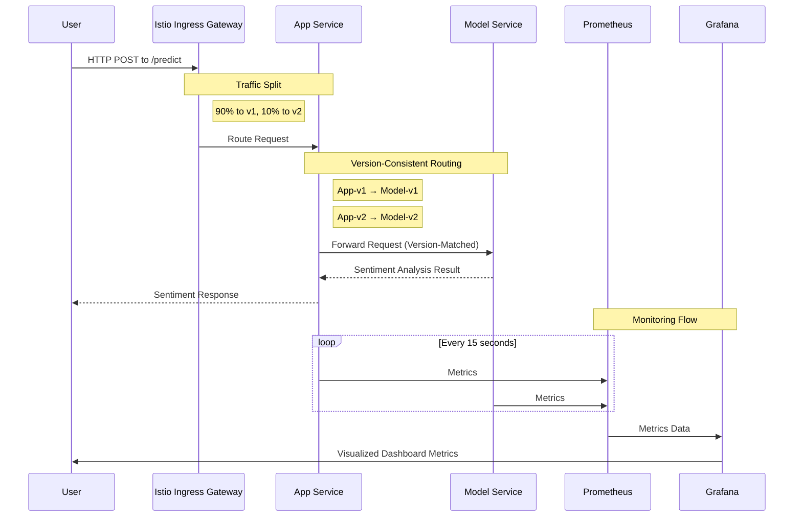
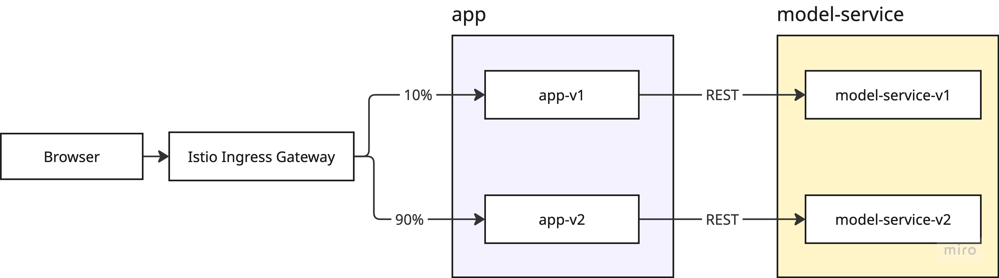

# Deployment Documentation
This document provides an overview of the deployment process for the application. 
It includes the structure of the deployment, the data flow for incoming requests, and visualizations to aid understanding.

## Deployment Structure
The deployment consists of several key components that work together to handle incoming requests and process data. The main components include:

### app
The app component is the main application that provides the front-end of the application and handles user requests. It is designed to be deployed in canary versions.

### model-service
The model-service handles the processing of data. It too is designed to handle canary versions, allowing for flexibility in deployment.

### prometheus & grafana
Prometheus is used for monitoring the application, collecting metrics, and providing insights into the performance of the deployed services. Grafana is used to visualize these metrics, allowing for easy monitoring and analysis.

### istio ingress gateway
The Istio Ingress Gateway is responsible for managing incoming traffic to the application. It routes requests to the appropriate services based on defined rules, enabling canary deployments and traffic splitting between different versions of the app.

## Kubernetes Architecture Overview

The general structure of the Kubernetes deployment is as follows:

- `control node` - The control node manages the Kubernetes cluster and orchestrates the deployment of applications.
- `worker node 1` - The worker node runs the application pods and handles the actual processing of requests.
- `worker node 2` - Another worker node that can run additional application pods for load balancing and redundancy.

Both worker nodes run the app and model-service pods. An istio ingress gateway is deployed to manage incoming traffic and route it to the appropriate services.

## Sequence Diagram

## Routing

The routing process is managed by the Istio Ingress Gateway, which directs incoming requests to the appropriate services based on defined rules. The sequence of operations is as follows:
1. **User Request**: A user sends a request to the application.
2. **Istio Ingress Gateway**: The request is received by the Istio Ingress Gateway, which determines the appropriate service to route the request to.
    - Sticky sessions ensure that once a user is routed to a specific version of the app, all subsequent requests from that user will be routed to the same version.
3. **App** The requests are split 90/10 between the two versions of the app (v1 and v2) based on the defined routing rules.
4. **Model-Service**: The model-service handles the processing of data, with requests being routed to either v1 or v2 based on the defined rules.

