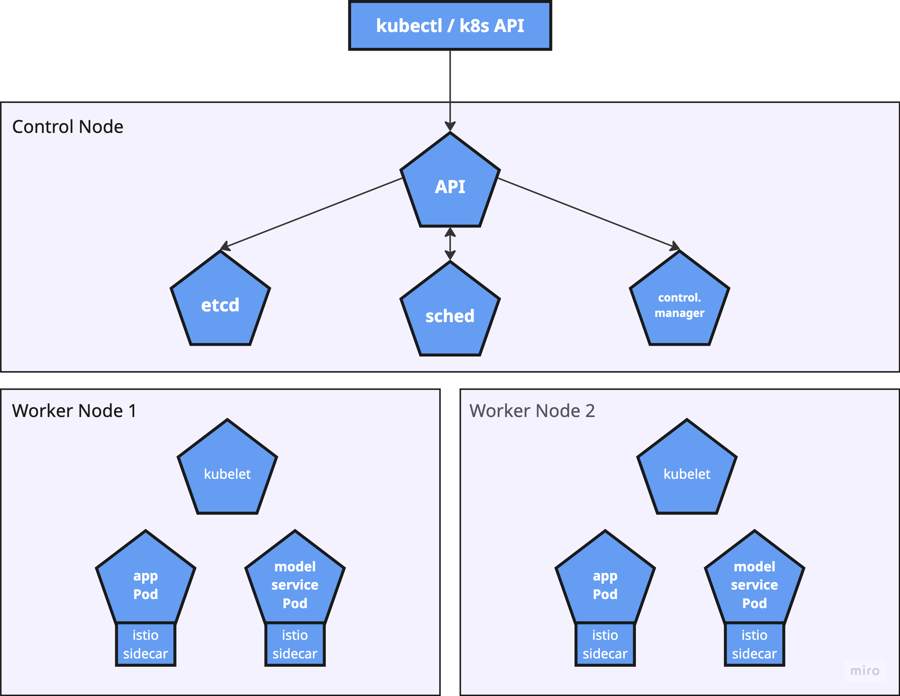

# Deployment Documentation
This document provides an overview of the deployment process for the application. 
It includes the structure of the deployment, the data flow for incoming requests, and visualizations to aid understanding.

# Key Repositories

The deployment consists of several repositories, each with a distinct and isolated responsibility within the system:

| Repository         | Responsibility                                                                                 |
|-------------------|-----------------------------------------------------------------------------------------------|
| [**app**](https://github.com/remla25-team6/app)           | Hosts the main application frontend and API, handling user requests and forwarding them to the model-service. Deployed as a canary (multiple versions possible). |
| [**model-service**](https://github.com/remla25-team6/model-service) | Provides the machine learning model API for sentiment analysis. Receives requests from the app and returns predictions. Also supports canary deployments. |
| [**model-training**](https://github.com/remla25-team6/model-training)| Contains the code and workflows for training and updating the sentiment analysis model. Not deployed as a service, but produces model artifacts for the model-service. |
| [**lib-ml**](https://github.com/remla25-team6/lib-ml)        | A shared Python library for data preprocessing and utilities, used by both model-training and model-service. Not deployed directly. |
| [**lib-version**](https://github.com/remla25-team6/lib-version)   | A shared Java library for versioning, used by the app to report and manage version information. Not deployed directly. |
| [**operation**](https://github.com/remla25-team6/operation)     | Contains deployment scripts, Kubernetes manifests, Helm charts, and documentation for provisioning, deploying, and monitoring the system. |

Each repository is developed and released independently, ensuring clear separation of concerns and facilitating isolated updates and rollbacks during deployment.

## Deployment Structure
The deployment consists of several key components that work together to handle incoming requests and process data. The main components include:

### app
The app component is the main application that provides the front-end of the application and handles user requests. It is designed to be deployed in canary versions.

### model-service
The model-service handles the processing of data. It too is designed to handle canary versions, allowing for flexibility in deployment.

### prometheus
Prometheus is used for monitoring the application, collecting metrics, and providing insights into the performance of the deployed services. It also evaluates alert rules and can trigger alerts when certain conditions are met.

### grafana
Grafana is used to visualize the metrics collected by Prometheus, allowing for easy monitoring and analysis. The dashboard shows the following:
- Application start time
- Stored responses (by sentiment)
- Inference latency Histogram (by sentiment)
- Inference Request Rate (by sentiment)

### istio ingress gateway
The Istio Ingress Gateway is responsible for managing incoming traffic to the application. It routes requests to the appropriate services based on 90/10 splitting rules, enabling canary deployments.

## Kubernetes Architecture Overview

The diagram below illustrates the high-level architecture of the Kubernetes cluster used in this deployment. The architecture is divided into two main types of nodes: the **Control Node** and the **Worker Nodes**.

- **Control Node:**
  The control node manages the overall state of the cluster and runs several key components:
  - **API Server:** The central management entity that receives commands from `kubectl` or other clients and interacts with all other control plane components.
  - **etcd:** A distributed key-value store that holds all cluster data and configuration.
  - **Scheduler (sched):** Assigns newly created pods to worker nodes based on resource availability and other constraints.
  - **Controller Manager:** Ensures the desired state of the cluster is maintained by managing controllers that handle tasks like node management, replication, and endpoints.

- **Worker Nodes:**
  Worker nodes are responsible for running application workloads. Each worker node runs:
  - **kubelet:** An agent that communicates with the control plane and ensures containers are running as expected.
  - **Pods:** The smallest deployable units in Kubernetes, which in this deployment include:
    - **app Pod:** Runs the main application, with an Istio sidecar for service mesh capabilities.
    - **model service Pod:** Runs the model service, also with an Istio sidecar.
  - **Istio Sidecar:** A proxy container injected into each pod to enable advanced networking features to handle traffic splitting and routing.

## Sequence Diagram

## Routing

The routing process is managed by the Istio Ingress Gateway, which directs incoming requests to the appropriate services based on defined rules. The sequence of operations is as follows:
1. **User Request**: A user sends a request to the application.
2. **Istio Ingress Gateway**: The request is received by the Istio Ingress Gateway, which determines the appropriate service to route the request to.
    - Sticky sessions ensure that once a user is routed to a specific version of the app, all subsequent requests from that user will be routed to the same version.
3. **App** The requests are split 90/10 between the two versions of the app (v1 and v2) based on the defined routing rules.
4. **Model-Service**: The model-service handles the processing of data, with requests being routed to either v1 or v2 based on the defined rules.

## Kubernetes Resources and Relationships

Below is a table of some examples of the Kubernetes resources used in this deployment.

| Resource Type           | Resource Name(s)                                 | Description                                                                                   |
|------------------------ |--------------------------------------------------|-------------------------------------------------------------------------------------------|
| Deployment              | `app-v1`, `app-v2`, `model-service-v1`, `model-service-v2` | Deploys the application and model-service pods for each version (canary releases).         |
| Service                 | `app-service`, `model-service`                   | Exposes the App and Model services internally for communication and metrics scraping.      |
| Gateway (Istio)         | `istio-ingressgateway`                           | Handles external HTTP(S) traffic into the cluster.                                         |
| VirtualService (Istio)  | `app-virtualservice`, `model-service-virtualservice` | Routes traffic from the gateway to the correct service/version based on routing rules.     |
| DestinationRule (Istio) | `app-destinationrule`, `model-service-destinationrule` | Defines subsets (v1, v2) for canary deployments and enables traffic splitting.             |
| ConfigMap               | `app-config`, `grafana-dashboard-config`         | Stores non-sensitive configuration data for the app and Grafana dashboards.                |
| Secret                  | `app-secret`                                     | Stores sensitive data such as credentials or tokens.                                       |
| ServiceMonitor          | `app-servicemonitor`                             | Configures Prometheus to scrape metrics from all App Services on the /metrics endpoint.                              |
| PrometheusRule          | `app-prometheusrule`                             | Defines alerting and recording rules for Prometheus.                                       |

